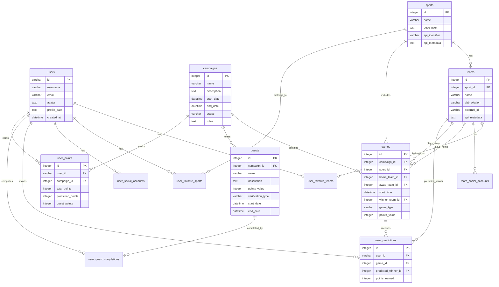

<!-- markdownlint-disable MD014 -->
<!-- markdownlint-disable MD033 -->
<!-- markdownlint-disable MD041 -->
<!-- markdownlint-disable MD029 -->

<div align="center">

<h1 style="font-size: 2.5rem; font-weight: bold;">RNG FanClub</h1>

  <p>
    <strong>connects athletes, fans, and brands to revolutionize sports</strong>
  </p>

</div>

<details>
  <summary>Table of Contents</summary>

- [Getting Started](#getting-started)
  - [Initializing the repository](#initializing-the-repository)
  - [Running the app](#running-the-app)
  - [Building for production](#building-for-production)
- [Contributing](#contributing)

</details>



## Getting Started

### Initializing the repository

To bootstrap the [API](./apps/api)'s SQLite (Cloudflare) and install dependencies:

```bash
bun run init
```

You can rerun this command to reset the full database.

### Running the app

First, run the development server:

```bash
bun run dev
```

This will run the Next.js app, and simulate a local Cloudflare worker.

### Building for production

```bash
bun run build
```

## Contributing

Contributions are what make the open source community such an amazing place to learn, inspire, and create. Any contributions you make are **greatly appreciated**.

If you're interested in contributing to this project, please read the [contribution guide](./CONTRIBUTING).

<div align="right">
<a href="https://nearbuilders.org" target="_blank">

</a>
</div>
